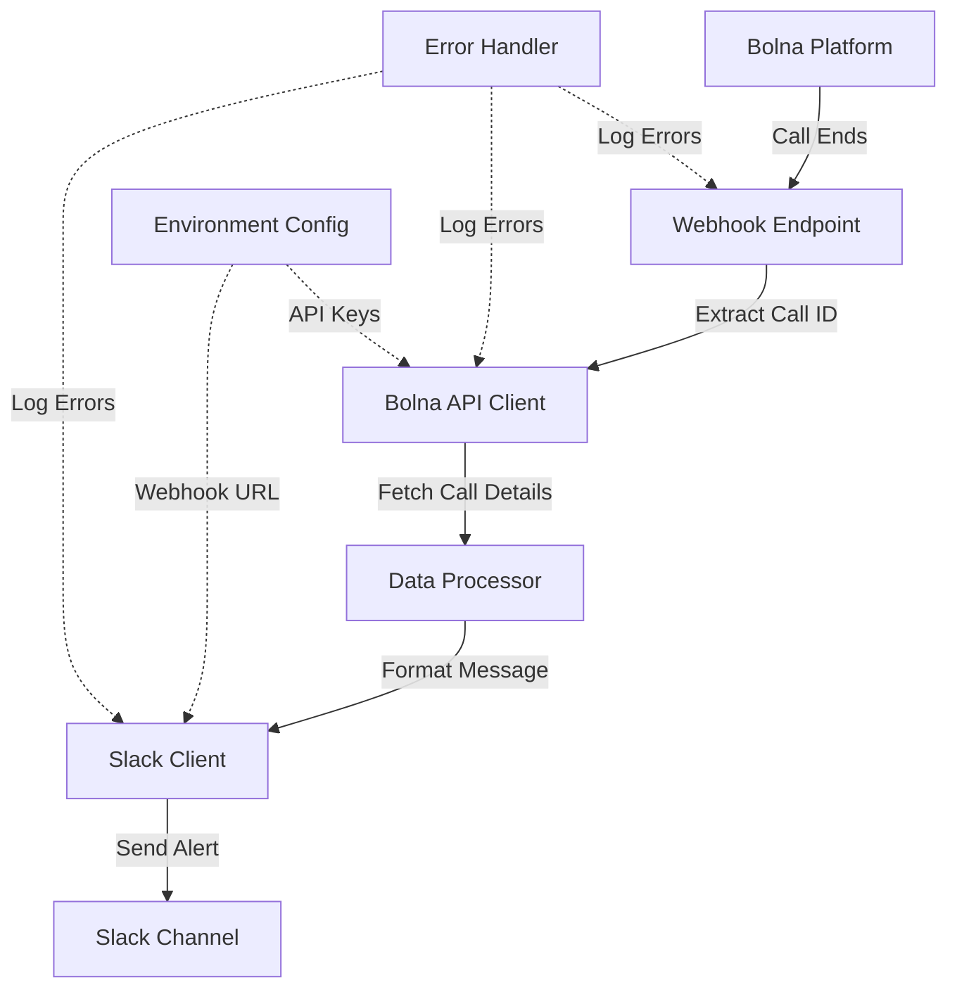

# Bolna-Slack Integration Architecture

## Overview
This integration sends Slack alerts when Bolna calls end, including call details like ID, agent ID, duration, and transcript.

## System Components

## Data Flow

1. **Webhook Reception**: Bolna sends POST request when call ends
2. **Call ID Extraction**: Extract call ID from webhook payload
3. **API Call**: Fetch full call details from Bolna API
4. **Data Processing**: Extract required fields (id, agent_id, duration, transcript)
5. **Message Formatting**: Create formatted Slack message
6. **Slack Delivery**: Send message to configured Slack channel

## API Integration Points

### Bolna API
- **Webhook Endpoint**: Receives call end events
- **GET /call/{call_id}**: Fetches complete call details
- **Authentication**: API key in headers

### Slack API
- **Incoming Webhooks**: Simple POST to webhook URL
- **Message Format**: JSON with blocks for rich formatting

## Technology Stack

**Backend**: Python 3.9+
- **Framework**: FastAPI (async, high performance, auto docs)
- **HTTP Client**: httpx (async HTTP requests)
- **Environment**: python-dotenv
- **Validation**: Pydantic models

**Deployment Options**:
- Local development server
- Docker container
- Cloud platforms (AWS Lambda, Google Cloud Functions, Heroku)

## Security Considerations

1. Environment variables for sensitive data
2. Webhook signature verification (if supported by Bolna)
3. HTTPS for production deployment
4. Rate limiting on webhook endpoint
5. Input validation and sanitization

## Error Handling

- Retry logic for failed Slack messages
- Comprehensive logging
- Graceful degradation if API calls fail
- Dead letter queue for failed webhooks (optional)

## Configuration

Required environment variables:
- `BOLNA_API_KEY`: Bolna API authentication
- `BOLNA_API_BASE_URL`: Bolna API endpoint
- `SLACK_WEBHOOK_URL`: Slack incoming webhook URL
- `PORT`: Server port (default: 8000)
- `LOG_LEVEL`: Logging verbosity (default: INFO)